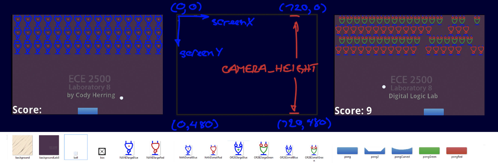

# 7.9 Smartphone App 

By: Prof. Dean R. Johnson, Electrical and Computer Engineering, Western Michigan University

This lab will examine the construction of a smartphone app. This exercise complements the hardware exploration of smartphones in the lecture and other labs.

## Overview

In this experiment, you will tinker with a software application for an **Android** smartphone. The app, called **BreakoutGate**, is a breakout arcade game about defending against alien NAND gates gone rogue. The game utilizes a game engine called **AndEngine** and is written in **Java**.

## Basic Concepts

Software applications may be developed for the Android platform with the Android software development kit (SDK), which is based upon the Java development kit (JDK).

To write code, programmers often use an integrated development environment (IDE), which includes a text editor along with other useful features. **Android Studio** is an IDE specifically built for Android development.

Games are typically developed with **game engines**, which are software frameworks that provide common game-related functions, such as physics, graphics, and animation. **BreakoutGate** uses code from **AndEngine**.

AndEngine is open source and can be found [on a GitHub repository](https://github.com/nicolasgramlich/AndEngine). The engine is outdated and no longer maintained, but it can still be used for Android game development.

## Tasks

The Tasks are as follows:

(1) Load the app and go

Note: If you want to also run this experiment from your home, then you will need to install [Android Studio](https://developer.android.com/studio) onto your computer, which will run on both PCs and Macs. After that, it would be best if you do the simple [Create an Android Project](https://developer.android.com/codelabs/basic-android-kotlin-compose-first-app), which will also load an **emulator** that looks like an Android smartphone display that you will need in the steps below. Please make sure you perform the second webpage called **Run your app** to get the emulator. The installation of Studio and the emulator will take about an hour. Then do the following:

1. Load the [BreakoutGate App](https://webwriters.com/ece2500/zybook/BreakoutGate2024.zip) folder into Android Studio from the link, otherwise your lab instructor will tell you where to find the source code.
2. Run breakoutGate. Go to Android Studio and press SHIFT F10 to start the game. It should show you the NAND gate bricks forming inverter circuits like shown above on the left.
3. (Optional) Download the app. Try downloading the app into your own Android phone:
   - Connect your Android with the micro USB cord 
   - Find breakout.apk in the bin folder on your PC. 
   - Drag it into your Dropouts Android folder. Click it.

(2) Some things to try (some for points*)

Here is a list of some things you can modify in the java software (src->main->java->com->example->ecelab->myapplication->breakoutGate.java) to alter the game. Please refer to the emulator screen dimensions and variables shown above.

1. Alter the velocity of the ball. Change the value of DEMO_VELOCITY in the beginning of of code.
2. Enter your name on the screen. Search for nameBox (CTRL F) and retype “Cody Herring” (the student who originally created this app) with your name. Center it on the line.
3. *Change the color of the NAND gate brick. Search for “NANDlargeBlue.png” and retype it with “NANDlargeRed.png”, see the graphics gfx assets folder (src->main->assets->gfx) also shown on small images above). Copy the resulting "this.mTexture" line of code to the export tester and validate your statement by running the output tester.
4. *Make SOP NAND circuits. Now lets try some harder things. Right shifting every other row of NAND bricks by ½ brick will cause the NAND gates to form SOP circuits. Your instructor will show you how to use an if else statement to do this, shifting every other row of gates (the back gates) by delX = blockWidth/2. Copy this section of code to the export tester and validate your statement by running the output tester.
5. *Making proper form SOP circuits. The SOP circuits in Step 4 are not drawn in 2-level proper form. Replace the shifted Red NAND gates with Green OR2B2 gates (see gfx folder assets image above). Copy the resulting "this.mTexture" line of code to the export tester and validate your statement by running the output tester.
6. *Increase the number of gates. Now replace all of the large gates with small gates from the gfx assets folder and increase the number of rows of gates in the display, as shown above on right. (If the ball launch is interfered by the lower rows of the gate bricks, lower the ball launching point on the screen.) Copy the resulting "final Ball ball" line of code to the export tester and validate your statement by running the output tester.

Press **Submit** to record the 12 points for this lab.
